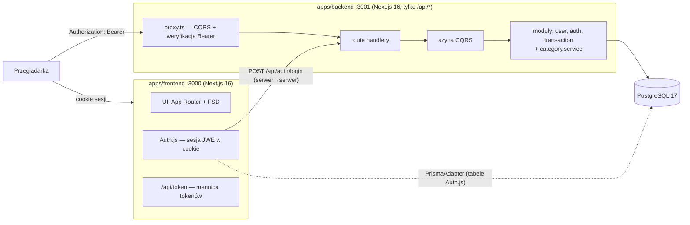
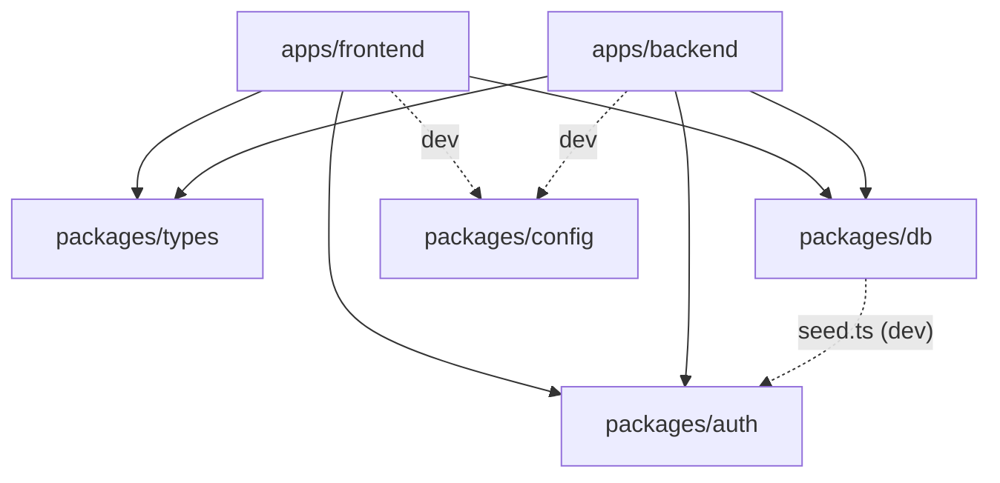
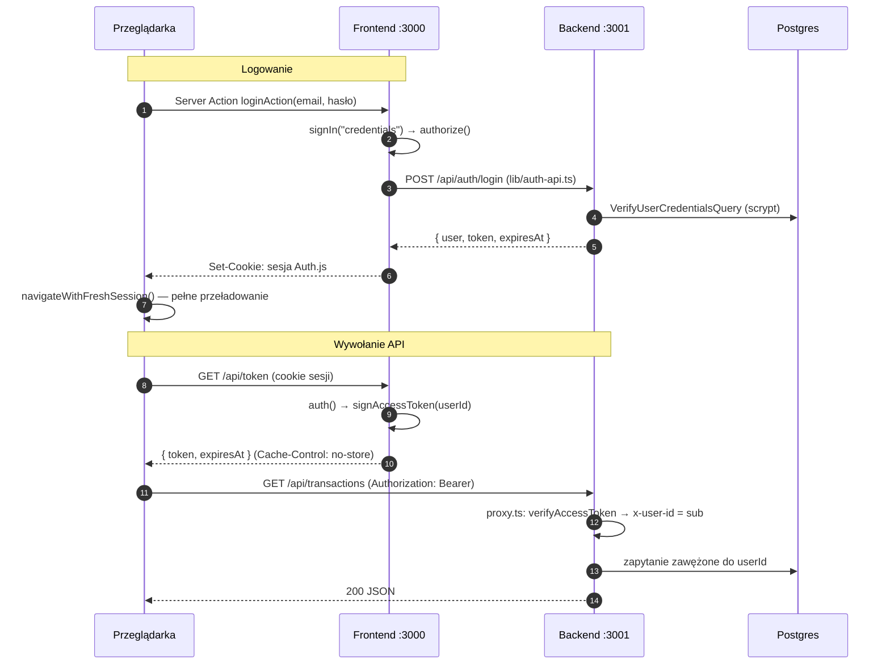
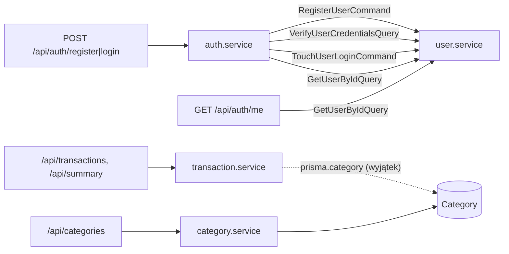

# Architektura Expence Tracker

Dokument referencyjny: jak system jest zbudowany i dlaczego. Reguły, których
trzeba przestrzegać przy zmianach, są w plikach `CLAUDE.md` (korzeń,
`apps/backend`, `apps/frontend`) — ten plik je streszcza i spina w jeden
obraz. Przy rozjeździe wygrywa kod, a potem `CLAUDE.md`.

Powiązane: [api.md](api.md) (endpointy), [database.md](database.md)
(schemat bazy), [dev-guide.md](dev-guide.md) (jak dodać moduł, funkcję,
migrację).

## 1. Obraz z lotu ptaka

Wieloużytkownikowa aplikacja do śledzenia finansów: konto, własne kategorie,
transakcje (przychody i wydatki), lista z filtrami i podsumowanie. Dane
każdego użytkownika są odizolowane — to twardy wymóg, na którym opiera się
cała autoryzacja.



Dwie **osobne** aplikacje Next.js w jednym monorepo pnpm:

- **`apps/frontend`** — całe UI i sesja użytkownika. Dane pobiera
  przeglądarka **bezpośrednio** z backendu, z krótkożyciowym tokenem Bearer.
  Serwer frontendu rozmawia z backendem tylko przy logowaniu i rejestracji.
- **`apps/backend`** — wyłącznie route handlery `/api/*`: bez stron, bez
  root layoutu, bez cookies, bez sesji. Bezstanowy — tożsamość wynika tylko
  z tokenu. Jedyne miejsce, które zna hasła.

## 2. Monorepo

```
expence-tracker/
├── apps/
│   ├── frontend/        @expence/frontend — UI, Auth.js, /api/token
│   └── backend/         @expence/backend  — REST /api/*, CQRS, OpenAPI
├── packages/
│   ├── types/           @expence/types  — kontrakt: schematy Zod + money.ts
│   ├── auth/            @expence/auth   — scrypt (hasła) + JWT HS256 (token API)
│   ├── db/              @expence/db     — schema.prisma, migracje, seed, klient Prismy
│   └── config/          @expence/config — wspólne tsconfig i ESLint
├── docker-compose.yml   Postgres 17
└── .env                 jeden plik dla wszystkich pakietów (wzór: .env.example)
```

Graf zależności (strzałka = „importuje”). Pakiety `packages/*` nie znają
żadnej aplikacji.



Frontend importuje `@expence/db` tylko po to, by podać klienta Prismy do
`PrismaAdapter` Auth.js (tabele `Account`/`Session`/`VerificationToken`).
Z danymi domenowymi (transakcje, kategorie) frontend nigdy nie rozmawia
bezpośrednio — tylko przez API backendu.

| Pakiet            | Rola                                                                                                                                                         | Kluczowe pliki                                                                                                                           |
| ----------------- | ------------------------------------------------------------------------------------------------------------------------------------------------------------ | ---------------------------------------------------------------------------------------------------------------------------------------- |
| `@expence/types`  | **Kontrakt.** Jedyne źródło prawdy o kształcie danych i regułach walidacji; ten sam schemat waliduje body w backendzie, formularz w UI i buduje spec OpenAPI | `api.ts` (błąd API), `auth.ts`, `category.ts`, `transaction.ts`, `summary.ts`, `money.ts`                                                |
| `@expence/auth`   | Kryptografia współdzielona przez obie aplikacje i seed                                                                                                       | `password.ts` (`hashPassword`, `verifyPassword`, `DUMMY_PASSWORD_HASH`), `token.ts` (`signAccessToken`, `verifyAccessToken`, TTL 10 min) |
| `@expence/db`     | Schemat, migracje, seed, singleton `prisma`                                                                                                                  | `prisma/schema.prisma`, `prisma.config.ts`, `src/index.ts`, `src/load-env.ts`                                                            |
| `@expence/config` | Bazowe `tsconfig` i ESLint 9                                                                                                                                 | `tsconfig.base.json`, `tsconfig.next.json`, `eslint.config.mjs`                                                                          |

## 3. Przepływ autoryzacji

Najważniejszy mechanizm w repo. Są **dwa niezależne tokeny**:

|              | Sesja przeglądarki                     | Token API                                                         |
| ------------ | -------------------------------------- | ----------------------------------------------------------------- |
| Format       | JWE Auth.js (zaszyfrowany)             | JWT HS256 (podpisany)                                             |
| Gdzie żyje   | cookie `authjs.session-token` na :3000 | pamięć karty (`api-client.ts`)                                    |
| Kto wystawia | Auth.js po `authorize()`               | backend (register/login) albo frontend `/api/token`               |
| Kto sprawdza | frontend (`auth()`)                    | backend (`proxy.ts`)                                              |
| Czas życia   | sesja Auth.js                          | 10 minut (`ACCESS_TOKEN_TTL_SECONDS`)                             |
| Claims       | —                                      | `sub` = userId, `iss` = `expence-auth`, `aud` = `expence-backend` |

Oba są podpisywane/szyfrowane tym samym `AUTH_SECRET` — musi być
identyczny po obu stronach, inaczej każde żądanie kończy się 401.



Zasady spinające obie strony:

- **`userId` pochodzi wyłącznie ze zweryfikowanego tokenu.** `proxy.ts`
  zawsze nadpisuje nagłówek `x-user-id`, a handler czyta go przez
  `requireUserId(request)`. Nigdy z body, query ani ścieżki (IDOR).
- **Cookie Auth.js nigdy nie trafia do backendu.** Backend nie zna cookies.
- **Hasła hashuje tylko `@expence/auth`**, a porównuje tylko moduł `user`
  backendu. `passwordHash` nie przekracza granicy tego modułu.
- **Zmiana tożsamości w karcie = pełne przeładowanie strony** (logowanie,
  rejestracja, wylogowanie), bo token API i cache TanStack Query żyją w
  pamięci karty.

## 4. Backend (`apps/backend`)

### 4.1 Warstwy żądania

```
żądanie HTTP
  │
  ▼
src/proxy.ts               CORS, preflight, PUBLIC_PATHS, verifyAccessToken → x-user-id
  │
  ▼
src/app/api/**/route.ts    cienka warstwa HTTP: requireUserId → parseJsonBody/parseQuery → dispatch
  │                        → mapowanie błędów domenowych na ok/created/noContent/fail
  ▼
src/server/bus             szyna CQRS: dispatch(Message) → jedyny handler
  │
  ▼
<modul>.handlers.ts        adapter: payload wiadomości → wywołanie serwisu
  │
  ▼
<modul>.service.ts         logika biznesowa, sprawdzanie własności, rzucanie błędów domenowych
  │
  ▼
<modul>.repository.ts      jedyne miejsce dotykające prisma.<model>; każde zapytanie zawężone do userId
  │
  ▼
@expence/db (Prisma 7 + @prisma/adapter-pg) → PostgreSQL
```

W drodze powrotnej `<modul>.mapper.ts` zamienia rekord Prismy na DTO z
`@expence/types` (daty → ISO 8601, bez pól wewnętrznych jak `userId` czy
`passwordHash`).

### 4.2 Moduły

```
src/server/
├── bus/
│   ├── bus.ts        createBus(): register/dispatch, jeden handler na typ wiadomości
│   ├── message.ts    defineCommand / defineQuery → fabryka { type, payload }
│   └── index.ts      createAppBus(): rejestruje handlery WSZYSTKICH modułów; eksportuje dispatch
├── modules/
│   ├── user/         konta i hasła (jedyny właściciel passwordHash)
│   ├── auth/         rejestracja i logowanie → token (bez dostępu do bazy)
│   └── transaction/  transakcje + podsumowanie
├── services/category.service.ts   kategorie — stary styl, poza szyną
└── mappers.ts                     toCategoryDto
```

Każdy moduł CQRS ma ten sam zestaw plików:

| Plik                | Odpowiedzialność                                         | Kto może importować                           |
| ------------------- | -------------------------------------------------------- | --------------------------------------------- |
| `<m>.messages.ts`   | definicje komend i zapytań + typy payloadu/wyniku        | **każdy** — to publiczne API modułu           |
| `<m>.errors.ts`     | klasy błędów domenowych (bez wiedzy o HTTP)              | moduł + route handlery (do mapowania na HTTP) |
| `<m>.handlers.ts`   | `register<M>Handlers(bus)` — wiąże wiadomości z serwisem | tylko `bus/index.ts`                          |
| `<m>.service.ts`    | logika biznesowa                                         | tylko własny moduł                            |
| `<m>.repository.ts` | dostęp do bazy                                           | tylko własny serwis                           |
| `<m>.mapper.ts`     | rekord Prismy → DTO                                      | tylko własny moduł                            |

Wiadomości na szynie:

| Moduł         | Komendy (zmieniają stan)                                                                                   | Zapytania (tylko odczyt)                                                                                                      |
| ------------- | ---------------------------------------------------------------------------------------------------------- | ----------------------------------------------------------------------------------------------------------------------------- |
| `user`        | `RegisterUserCommand` (`user.register`), `TouchUserLoginCommand` (`user.touchLogin`)                       | `VerifyUserCredentialsQuery` (`user.verifyCredentials` → `{ userId, isActive } \| null`), `GetUserByIdQuery` (`user.getById`) |
| `auth`        | `RegisterCommand` (`auth.register`), `LoginCommand` (`auth.login` — komenda, bo aktualizuje `lastLoginAt`) | —                                                                                                                             |
| `transaction` | `CreateTransactionCommand`, `UpdateTransactionCommand`, `DeleteTransactionCommand`                         | `ListTransactionsQuery`, `GetTransactionQuery`, `GetTransactionSummaryQuery`                                                  |

Komunikacja między modułami (strzałka = `dispatch`):



### 4.3 Reguły modułów

- Moduły rozmawiają ze sobą **wyłącznie przez szynę** — `auth.service.ts`
  nie widzi `user.repository.ts` ani Prismy.
- Serwis dostaje `dispatch` **argumentem** (nie importuje singletonu z
  `bus/index.ts`), bo inaczej powstałby cykl
  `bus/index.ts → *.handlers.ts → *.service.ts → bus/index.ts`. Przy okazji
  serwis da się testować z atrapą `dispatch`.
- Szyna **nie** jest cache'owana na `globalThis` (w przeciwieństwie do
  `prisma`): po hot reloadzie w dev trzymałaby stare klasy błędów i
  `instanceof` w route handlerze przestałby działać.
- **Wyjątek od reguły szyny:** `transaction.repository.ts` czyta
  `prisma.category` bezpośrednio (`categoryBelongsToUser`,
  `findCategoriesByIds`), bo kategorie nie są jeszcze modułem CQRS. Po
  migracji kategorii zamieni się to na `dispatch(...)`.

## 5. Frontend (`apps/frontend`)

### 5.1 Trasy

| Ścieżka                        | Rola                                                                                  |
| ------------------------------ | ------------------------------------------------------------------------------------- |
| `/`                            | `redirect("/transactions")`                                                           |
| `/sign-in`, `/sign-up`         | publiczne (grupa `(auth)`)                                                            |
| `/transactions`, `/categories` | chronione (grupa `(dashboard)`, `auth()` w layoucie + tani check cookie w `proxy.ts`) |
| `/api/auth/[...nextauth]`      | handlery Auth.js                                                                      |
| `/api/token`                   | mennica tokenów API                                                                   |

### 5.2 Feature-Sliced Design

Import tylko w dół: `app` → `widgets` → `features` → `entities` → shared.

```
src/
├── app/                   „pages” FSD: trasy Next, tylko kompozycja + auth guard
├── widgets/               samodzielne bloki strony
│   ├── app-header/            logo, menu sekcji, menu profilu
│   ├── auth-card/             ramka formularzy logowania/rejestracji
│   ├── transactions-summary/  karty Przychody / Wydatki / Saldo
│   └── transactions-table/    tabela, paginacja, akcje wiersza
├── features/              jedna intencja użytkownika
│   ├── auth/{login,register,logout}/
│   └── transaction/{upsert,delete,filter}/
├── entities/
│   └── transaction/       useTransactions, TransactionAmount, etykiety typów
├── components/ui/         [shared] prymitywy shadcn/ui
├── lib/                   [shared] api-client, auth-api, query-keys, session-navigation, date, utils
└── components/categories/, hooks/   stary płaski układ (kategorie) — do osobnej migracji
```

Segmenty w slice'ie: `ui/` (komponenty), `api/` (Server Action albo
zapytanie/mutacja TanStack Query), `model/` (stan, np. filtry w URL).
**Publiczne API slice'a to wyłącznie `index.ts` w jego korzeniu.**

### 5.3 Przepływ danych w UI

```
komponent (widget/feature)
  → hook TanStack Query (entities/*/api = odczyt, features/*/*/api = mutacja)
    → apiFetch<T>() z lib/api-client.ts
      → token z pamięci karty (odświeżany z /api/token z 30 s zapasem, jedno
        odświeżenie dla równoległych zapytań)
      → fetch(NEXT_PUBLIC_API_URL + path, Bearer)
    ← JSON albo ApiRequestError { status, code, message, fields }
  ← mutacja unieważnia całe gałęzie cache'a (queryKeys.transactions.all, .summary.all)
```

Formularze: react-hook-form + `standardSchemaResolver` ze schematem z
`@expence/types`. Dla schematów z transformacją (kwota) do API idzie
`z.input` (surowe wartości formularza) — backend sam przelicza je tym samym
schematem.

## 6. Wzorce

| Wzorzec                              | Gdzie                                                    | Po co                                                                                             |
| ------------------------------------ | -------------------------------------------------------- | ------------------------------------------------------------------------------------------------- |
| **CQRS z szyną w pamięci**           | `apps/backend/src/server/bus`                            | luźne powiązanie modułów; jeden handler na wiadomość; komenda zmienia stan, zapytanie tylko czyta |
| **Jeden plik publiczny modułu**      | `*.messages.ts` (backend), `index.ts` slice'a (frontend) | granica modułu jest jawna; reszta to szczegół implementacyjny                                     |
| **Repository**                       | `*.repository.ts`                                        | jedyne miejsce z Prismą w module; zawężanie do `userId` w jednym miejscu                          |
| **Mapper → DTO**                     | `*.mapper.ts`, `server/mappers.ts`                       | API nigdy nie zwraca rekordu Prismy; pola wewnętrzne nie wyciekają                                |
| **Błędy domenowe → HTTP**            | `*.errors.ts` + route handler                            | serwis nie zna kodów HTTP; handler tłumaczy klasę błędu na `fail(code, …)`                        |
| **Schema-first contract**            | `packages/types`                                         | ta sama walidacja w UI, API i OpenAPI; brak rozjazdu definicji                                    |
| **Scoped writes**                    | `updateMany`/`deleteMany` z `where: { id, userId }`      | cudzy rekord daje `count === 0` → 404, bez zdradzania jego istnienia                              |
| **Bezstanowy token**                 | `@expence/auth`, `proxy.ts`                              | weryfikacja bez zapytania do bazy; backend bez sesji                                              |
| **Stała praca przy logowaniu**       | `DUMMY_PASSWORD_HASH` w `verifyCredentials`              | czas odpowiedzi nie zdradza, które e-maile istnieją                                               |
| **Pieniądze jako grosze (`Int`)**    | cały stos, `money.ts`                                    | brak błędów zaokrągleń; konwersja tylko na granicy UI                                             |
| **OpenAPI ze schematów Zod**         | `src/openapi/*` (`zod-openapi`)                          | spec nie rozjeżdża się z walidacją                                                                |
| **Singleton Prismy na `globalThis`** | `packages/db/src/index.ts`                               | hot reload w dev nie mnoży puli połączeń                                                          |

## 7. Znane odstępstwa i dług

- **Kategorie w backendzie nie są modułem CQRS** — `category.service.ts`
  wołany wprost z route'ów; stąd wyjątek w `transaction.repository.ts`.
- **Kategorie we frontendzie nie są w FSD** — `components/categories/` +
  `hooks/use-categories.ts`, gołe elementy HTML bez shadcn/ui.
- **`/api/summary` nie ma konsumenta w UI** — `hooks/use-summary.ts`
  istnieje, ale karty podsumowania czytają `totals` z listy transakcji.
- **`Budget`** ma model w bazie, ale nie ma API ani UI.
- **Testy tylko w backendzie** — Vitest w `apps/backend` (`pnpm test`);
  frontend i pakiety weryfikuje `pnpm lint`, `pnpm typecheck`, `pnpm build`
  i ręczne sprawdzenie (curl, przeglądarka). Brak testów E2E.
- **Grupowanie podsumowania po miesiącu** liczone w pamięci (Prisma nie
  grupuje po wyrażeniu na dacie) — przy dużej skali do zamiany na
  `$queryRaw` z `date_trunc`.
