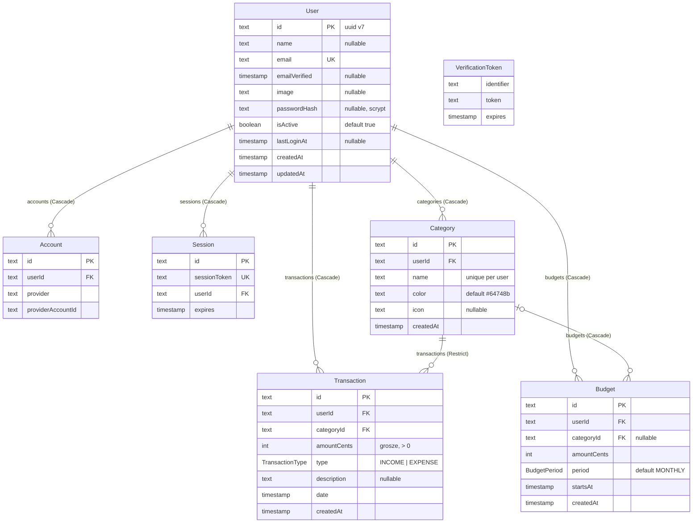

# Baza danych

Schemat PostgreSQL, znaczenie pól i ich przypisanie do DTO API. Źródło
prawdy: `packages/db/prisma/schema.prisma` i migracje w
`packages/db/prisma/migrations/`.

Powiązane: [architecture.md](architecture.md), [api.md](api.md),
[dev-guide.md](dev-guide.md#3-nowa-migracja) (jak dodać migrację).

## 1. Infrastruktura

| Element              | Wartość                                                                                                             |
| -------------------- | ------------------------------------------------------------------------------------------------------------------- |
| Silnik               | PostgreSQL 17 (`postgres:17-alpine`, kontener `expence-tracker-db`)                                                 |
| Dane logowania (dev) | użytkownik `expence`, hasło `expence`, baza `expence_tracker`                                                       |
| Port hosta           | `POSTGRES_PORT` z `.env` (domyślnie `5432`)                                                                         |
| Wolumen              | `pgdata` (kasuje go `pnpm db:reset`)                                                                                |
| Connection string    | `DATABASE_URL` w `.env` → czytany przez `packages/db/prisma.config.ts` (CLI) i `packages/db/src/index.ts` (runtime) |
| ORM                  | Prisma 7, generator `prisma-client`, klient w `packages/db/src/generated/prisma` (poza gitem)                       |
| Połączenie w runtime | driver adapter `@prisma/adapter-pg`; singleton `prisma` cache'owany na `globalThis` poza produkcją                  |

Prisma 7 **nie** przyjmuje `url` w bloku `datasource` schematu — adres jest
tylko w `prisma.config.ts`.

## 2. Konwencje schematu

- **Klucze główne**: `String @id @default(uuid(7))` — UUID v7 (sortowalny w
  czasie). Generuje go **klient Prismy**, nie baza: w SQL kolumna `id` nie
  ma `DEFAULT`. Ręczny `INSERT` (SQL, Prisma Studio poza klientem) musi podać
  `id` sam.
- **Znaczniki czasu**: `DateTime` → `TIMESTAMP(3)` **bez strefy**. Prisma
  zapisuje i czyta je jako UTC; API zwraca je jako ISO 8601 z `Z`.
- **`updatedAt`**: `@updatedAt` ustawia klient Prismy, w SQL nie ma
  `DEFAULT` ani triggera. Mają je tylko `User` (a nie `Category` czy
  `Transaction`).
- **Pieniądze**: `Int` w groszach (`amountCents`), nigdy `Float`/`Decimal`.
- **Własność**: każda tabela domenowa ma kolumnę `userId` z FK do `User`
  (`onDelete: Cascade`) i indeks zaczynający się od `userId`. Każde
  zapytanie w backendzie jest zawężone do `userId`.
- **Nazwy**: modele w PascalCase, pola w camelCase (tabele i kolumny w SQL
  mają te same nazwy, w cudzysłowach). Wyjątek: pola `Account` w snake_case
  narzucone przez adapter Auth.js.

## 3. Diagram

## 4. Modele domenowe

Kolumna „DTO” mówi, gdzie pole trafia w odpowiedzi API (typy z
`packages/types`). „—” oznacza, że pole nie wychodzi poza backend.

### `User`

Konto użytkownika. Jedyny właściciel w kodzie: moduł `user` backendu
(`user.repository.ts`); Auth.js we frontendzie czyta/zapisuje go przez
`PrismaAdapter` (tylko przy providerach OAuth, których dziś nie ma).

| Pole            | Typ Prisma  | SQL            | Null | Domyślnie             | Opis                                                                                                          | DTO (`UserDto`)   |
| --------------- | ----------- | -------------- | ---- | --------------------- | ------------------------------------------------------------------------------------------------------------- | ----------------- |
| `id`            | `String`    | `TEXT` PK      | nie  | `uuid(7)` (klient)    | identyfikator; `sub` w tokenie API                                                                            | `id`              |
| `name`          | `String?`   | `TEXT`         | tak  | —                     | imię z rejestracji (1–64 znaki po walidacji)                                                                  | `name`            |
| `email`         | `String`    | `TEXT` UNIQUE  | nie  | —                     | login; zapisywany po `trim().toLowerCase()`                                                                   | `email`           |
| `emailVerified` | `DateTime?` | `TIMESTAMP(3)` | tak  | —                     | pole adaptera Auth.js; nieużywane                                                                             | —                 |
| `image`         | `String?`   | `TEXT`         | tak  | —                     | awatar (OAuth); dziś zawsze `null`                                                                            | `image`           |
| `passwordHash`  | `String?`   | `TEXT`         | tak  | —                     | `scrypt$<salt-hex>$<hash-hex>` z `@expence/auth`; `null` dla kont OAuth. **Nigdy nie opuszcza modułu `user`** | —                 |
| `isActive`      | `Boolean`   | `BOOLEAN`      | nie  | `true`                | miękka blokada; `false` → login `403 FORBIDDEN`                                                               | —                 |
| `lastLoginAt`   | `DateTime?` | `TIMESTAMP(3)` | tak  | —                     | ustawiane przez `TouchUserLoginCommand` przy każdym logowaniu                                                 | —                 |
| `createdAt`     | `DateTime`  | `TIMESTAMP(3)` | nie  | `now()`               | data rejestracji                                                                                              | `createdAt` (ISO) |
| `updatedAt`     | `DateTime`  | `TIMESTAMP(3)` | nie  | `@updatedAt` (klient) | ostatnia zmiana rekordu                                                                                       | —                 |

Mapper: `apps/backend/src/server/modules/user/user.mapper.ts` (`toUserDto`).

### `Category`

Kategoria transakcji użytkownika. Właściciel w kodzie:
`apps/backend/src/server/services/category.service.ts`; moduł `transaction`
czyta ją bezpośrednio (sprawdzenie własności, etykiety podsumowania).

| Pole        | Typ Prisma | SQL                   | Null | Domyślnie          | Opis                                                   | DTO (`CategoryDto`) |
| ----------- | ---------- | --------------------- | ---- | ------------------ | ------------------------------------------------------ | ------------------- |
| `id`        | `String`   | `TEXT` PK             | nie  | `uuid(7)` (klient) |                                                        | `id`                |
| `userId`    | `String`   | `TEXT` FK → `User.id` | nie  | —                  | właściciel; ustawiany z tokenu                         | —                   |
| `name`      | `String`   | `TEXT`                | nie  | —                  | 1–48 znaków; unikalna w parze `(userId, name)`         | `name`              |
| `color`     | `String`   | `TEXT`                | nie  | `'#64748b'`        | `#rrggbb` (walidacja w `hexColorSchema`, nie w bazie)  | `color`             |
| `icon`      | `String?`  | `TEXT`                | tak  | —                  | nazwa ikony `lucide-react`, max 32 znaki               | `icon`              |
| `createdAt` | `DateTime` | `TIMESTAMP(3)`        | nie  | `now()`            | sortowanie nie używa tego pola (lista idzie po `name`) | `createdAt` (ISO)   |

Mapper: `apps/backend/src/server/mappers.ts` (`toCategoryDto`).

### `Transaction`

Przychód albo wydatek. Właściciel w kodzie: moduł `transaction`
(`transaction.repository.ts`).

| Pole          | Typ Prisma        | SQL                       | Null | Domyślnie          | Opis                                                                                    | DTO (`TransactionDto`)                              |
| ------------- | ----------------- | ------------------------- | ---- | ------------------ | --------------------------------------------------------------------------------------- | --------------------------------------------------- |
| `id`          | `String`          | `TEXT` PK                 | nie  | `uuid(7)` (klient) |                                                                                         | `id`                                                |
| `userId`      | `String`          | `TEXT` FK → `User.id`     | nie  | —                  | właściciel; ustawiany z tokenu                                                          | —                                                   |
| `categoryId`  | `String`          | `TEXT` FK → `Category.id` | nie  | —                  | kategoria **tego samego** użytkownika (sprawdza serwis, nie baza)                       | zastąpione zagnieżdżonym `category` (`CategoryDto`) |
| `amountCents` | `Int`             | `INTEGER`                 | nie  | —                  | kwota w groszach, **zawsze > 0**, max 1 000 000 000; znak wynika z `type`               | `amountCents`                                       |
| `type`        | `TransactionType` | enum                      | nie  | —                  | `INCOME` / `EXPENSE`                                                                    | `type`                                              |
| `description` | `String?`         | `TEXT`                    | tak  | —                  | max 280 znaków (walidacja w Zod)                                                        | `description`                                       |
| `date`        | `DateTime`        | `TIMESTAMP(3)`            | nie  | —                  | dzień transakcji; UI zapisuje południe czasu lokalnego, żeby strefa nie przesunęła dnia | `date` (ISO)                                        |
| `createdAt`   | `DateTime`        | `TIMESTAMP(3)`            | nie  | `now()`            | drugi klucz sortowania listy                                                            | `createdAt` (ISO)                                   |

Mapper: `transaction.mapper.ts` (`toTransactionDto`, wymaga
`include: { category: true }`).

Przypisanie pól przy zapisie (`transaction.service.ts`):

| Wejście API (`createTransactionSchema`) | Kolumna       | Przekształcenie                                                               |
| --------------------------------------- | ------------- | ----------------------------------------------------------------------------- |
| `amount` (`"12,50"` / `12.5`)           | `amountCents` | `amountInputSchema`: przecinek → kropka, `Math.round(x * 100)` → `1250`       |
| `type`                                  | `type`        | bez zmian                                                                     |
| `description`                           | `description` | `undefined`/`null` → `null`; trim                                             |
| `date` (ISO)                            | `date`        | `new Date(iso)`                                                               |
| `categoryId`                            | `categoryId`  | po `categoryBelongsToUser` (inaczej `TransactionCategoryNotFoundError` → 400) |
| — (token)                               | `userId`      | z `x-user-id`, nigdy z body                                                   |

Przy `PATCH` zapisywane są tylko pola obecne w body (`updateMany` z
`where: { id, userId }`).

### `Budget` (bez API)

Limit kwotowy na kategorię (albo globalny) w okresie. Model istnieje od
pierwszej migracji, ale **nie ma go w żadnym serwisie, API ani UI**.

| Pole          | Typ Prisma     | SQL                       | Null | Domyślnie          | Opis                                           |
| ------------- | -------------- | ------------------------- | ---- | ------------------ | ---------------------------------------------- |
| `id`          | `String`       | `TEXT` PK                 | nie  | `uuid(7)` (klient) |                                                |
| `userId`      | `String`       | `TEXT` FK → `User.id`     | nie  | —                  | właściciel                                     |
| `categoryId`  | `String?`      | `TEXT` FK → `Category.id` | tak  | —                  | `null` = budżet globalny (wszystkie kategorie) |
| `amountCents` | `Int`          | `INTEGER`                 | nie  | —                  | limit w groszach                               |
| `period`      | `BudgetPeriod` | enum                      | nie  | `MONTHLY`          | `WEEKLY` / `MONTHLY`                           |
| `startsAt`    | `DateTime`     | `TIMESTAMP(3)`            | nie  | —                  | początek okresu                                |
| `createdAt`   | `DateTime`     | `TIMESTAMP(3)`            | nie  | `now()`            |                                                |

> **Uwaga przy implementacji API budżetów:** unikalność
> `@@unique([userId, categoryId, period, startsAt])` **nie chroni budżetów
> globalnych** — w PostgreSQL `NULL` w `categoryId` nie jest równy innemu
> `NULL`, więc dwa globalne budżety na ten sam okres przejdą. Trzeba to
> sprawdzić w serwisie albo dodać częściowy indeks unikalny w migracji
> (`--create-only`, patrz [dev-guide.md](dev-guide.md#3-nowa-migracja)).

## 5. Modele Auth.js

Kształt narzucony przez `@auth/prisma-adapter` — **nie zmieniaj nazw pól**,
adapter mapuje je 1:1. Frontend podaje adapter do `NextAuth(...)` w
`apps/frontend/src/auth.ts`, ale przy sesji w JWT i samym providerze
Credentials te tabele są w praktyce puste. Ożyją po dodaniu providera OAuth.

| Model               | Rola                                                                                                                                    | Klucze                                                                               |
| ------------------- | --------------------------------------------------------------------------------------------------------------------------------------- | ------------------------------------------------------------------------------------ |
| `Account`           | powiązanie konta z providerem OAuth (`refresh_token`, `access_token`, `expires_at`, `token_type`, `scope`, `id_token`, `session_state`) | PK `id`; UNIQUE `(provider, providerAccountId)`; INDEX `userId`; FK `userId` Cascade |
| `Session`           | sesje w bazie (nieużywane — strategia `jwt`)                                                                                            | PK `id`; UNIQUE `sessionToken`; INDEX `userId`; FK `userId` Cascade                  |
| `VerificationToken` | tokeny logowania e-mailem (nieużywane)                                                                                                  | UNIQUE `(identifier, token)`, bez PK                                                 |

## 6. Enumy

| Enum              | Wartości            | Używany w                                                |
| ----------------- | ------------------- | -------------------------------------------------------- |
| `TransactionType` | `INCOME`, `EXPENSE` | `Transaction.type`; w kontrakcie `transactionTypeSchema` |
| `BudgetPeriod`    | `WEEKLY`, `MONTHLY` | `Budget.period`; brak odpowiednika w `packages/types`    |

## 7. Relacje i usuwanie

| Relacja                | FK                       | `onDelete`   | Skutek                                                                                       |
| ---------------------- | ------------------------ | ------------ | -------------------------------------------------------------------------------------------- |
| `Account.user`         | `Account.userId`         | Cascade      | usunięcie użytkownika usuwa konta OAuth                                                      |
| `Session.user`         | `Session.userId`         | Cascade      | … i sesje                                                                                    |
| `Category.user`        | `Category.userId`        | Cascade      | … i kategorie                                                                                |
| `Transaction.user`     | `Transaction.userId`     | Cascade      | … i transakcje                                                                               |
| `Budget.user`          | `Budget.userId`          | Cascade      | … i budżety                                                                                  |
| `Transaction.category` | `Transaction.categoryId` | **Restrict** | kategorii z transakcjami nie da się usunąć → `P2003` → `CategoryInUseError` → `409 CONFLICT` |
| `Budget.category`      | `Budget.categoryId`      | Cascade      | usunięcie kategorii usuwa jej budżety                                                        |

Wszystkie FK mają `ON UPDATE CASCADE` (domyślne Prismy).

Kolejność kaskady przy usuwaniu użytkownika działa, bo transakcje i
kategorie odpadają w tej samej operacji. Nie ma dziś endpointu usuwania
konta.

## 8. Indeksy

| Indeks                                          | Typ                     | Obsługuje                                                                      |
| ----------------------------------------------- | ----------------------- | ------------------------------------------------------------------------------ |
| `User_email_key`                                | UNIQUE `(email)`        | logowanie (`findUnique({ email })`), wykrycie zajętego e-maila (`P2002` → 409) |
| `Category_userId_name_key`                      | UNIQUE `(userId, name)` | unikalna nazwa kategorii per użytkownik (`P2002` → 409); upsert w seedzie      |
| `Category_userId_idx`                           | `(userId)`              | `GET /api/categories`                                                          |
| `Transaction_userId_date_idx`                   | `(userId, date)`        | lista z filtrem dat i sortowaniem po dacie, podsumowanie                       |
| `Transaction_userId_categoryId_idx`             | `(userId, categoryId)`  | filtr po kategorii, grupowanie po kategorii, sprawdzenie Restrict              |
| `Budget_userId_idx`                             | `(userId)`              | przyszłe API budżetów                                                          |
| `Budget_userId_categoryId_period_startsAt_key`  | UNIQUE                  | jeden budżet na kategorię i okres (z zastrzeżeniem o `NULL`)                   |
| `Account_*`, `Session_*`, `VerificationToken_*` | —                       | adapter Auth.js                                                                |

## 9. Kto dotyka której tabeli

| Tabela                                    | Zapis                                              | Odczyt                                                                       |
| ----------------------------------------- | -------------------------------------------------- | ---------------------------------------------------------------------------- |
| `User`                                    | `user.repository.ts` (create, `lastLoginAt`), seed | `user.repository.ts`, `PrismaAdapter`                                        |
| `Category`                                | `category.service.ts`, seed                        | `category.service.ts`, `transaction.repository.ts` (wyjątek od reguły szyny) |
| `Transaction`                             | `transaction.repository.ts`, seed                  | `transaction.repository.ts`                                                  |
| `Budget`                                  | nikt                                               | nikt                                                                         |
| `Account`, `Session`, `VerificationToken` | `PrismaAdapter` (frontend)                         | `PrismaAdapter`                                                              |
| —                                         | `GET /api/health`                                  | `SELECT 1`                                                                   |

## 10. Historia migracji

| Migracja                          | Zmiana                                                                                                                                                                                      |
| --------------------------------- | ------------------------------------------------------------------------------------------------------------------------------------------------------------------------------------------- |
| `20260909233310_init`             | `User`, `Account`, `Session`, `VerificationToken`, `Category`, `Budget`, enum `BudgetPeriod` oraz wczesny model `Expense` (`amountCents`, `currency`, `spentAt`, `categoryId` z `SET NULL`) |
| `20260910153435_add_transactions` | enum `TransactionType`, tabela `Transaction` z indeksami `(userId, date)` i `(userId, categoryId)`; FK na kategorię z `RESTRICT`                                                            |
| `20260910221238_remove_expense`   | usunięcie `Expense` — jedynym modelem ruchów pieniędzy jest `Transaction`                                                                                                                   |

## 11. Seed

`packages/db/prisma/seed.ts`, uruchamiany przez `pnpm db:seed` (`tsx`,
wskazany w `prisma.config.ts`). Idempotentny:

1. `upsert` użytkownika `dev@expence.local` / `dev12345` (hash przez
   `hashPassword` z `@expence/auth`; `update` też ustawia hash).
2. `upsert` 7 kategorii po `(userId, name)`: Wynagrodzenie, Jedzenie,
   Transport, Mieszkanie, Rozrywka, Zdrowie, Inne (z kolorem i ikoną).
3. **Tylko gdy użytkownik nie ma żadnych transakcji** — 30 transakcji
   (szablon 10 na miesiąc × 3 miesiące wstecz od dziś), żeby powtórny seed
   nie mnożył danych.

Skrypt importuje `../src/load-env.js` **przed** `../src/index.js`, bo
generator `prisma-client` nie ładuje `.env` sam.
